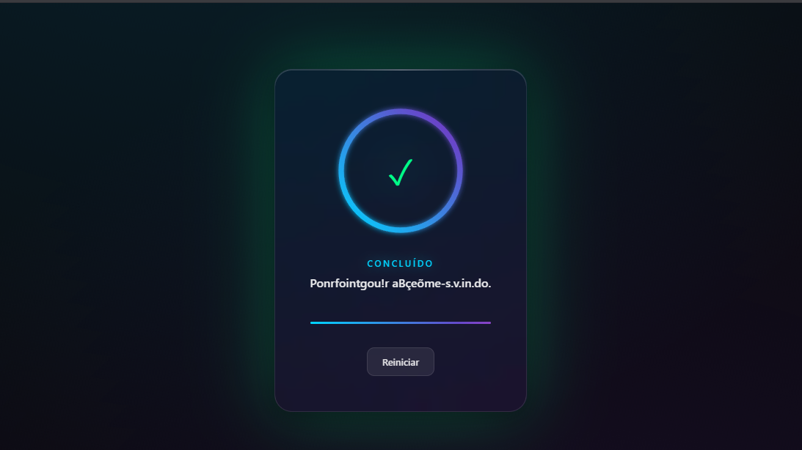

# Quantum Glass Loader 🚀

[]()
[]()
[]()

> Um loader moderno e interativo com **glassmorphism**, progressão **não-linear** e micro-interações fluidas. Desenvolvido como projeto de 7 dias para aprender boas práticas de frontend modular.



## ✨ Features Atuais

- **🎨 Glassmorphism 2.0** - Efeito de vidro fosco com `backdrop-filter` e gradientes dinâmicos
- **📊 Progresso Realista** - Simulação de rede com velocidades variáveis (não é linear!)
- **🎯 Micro-interações** - Pausar, simular erro, reiniciar com animações suaves
- **🎉 Partículas** - Explosão de confete ao completar com física realista
- **⌨️ Acessibilidade** - Navegação por teclado, ARIA labels, `prefers-reduced-motion`
- **📱 Responsivo** - Adaptativo para mobile e desktop

## 🎮 Controles

| Ação | Mouse | Teclado |
|------|-------|---------|
| Pausar/Continuar | Botão "Pausar" | `ESC` |
| Simular Erro | Botão "Simular Erro" | - |
| Reiniciar | Botão "Reiniciar" | `R` |

## 🏗️ Arquitetura Modular

```
Quantum Glass Loader/
├── index.html              # Estrutura semântica
├── css/
│   ├── base.css            # Variáveis, reset, utilitários
│   ├── glass-container.css # Efeito vidro + estados
│   ├── progress-ring.css   # SVG circular + glow
│   ├── typography.css      # Textos + efeito digitação
│   └── controls.css        # Botões + interações
└── js/
    ├── config.js           # Constantes centralizadas
    ├── state.js            # Gerenciamento de estado
    ├── particles.js        # Sistema de confete
    ├── ui-updater.js       # Atualizações DOM
    ├── progress.js         # Lógica de animação
    └── main.js             # Orquestrador
```

## 🚀 Como Usar

### Local
```bash
git clone https://github.com/seu-usuario/quantum-glass-loader.git
cd quantum-glass-loader
# Abrir index.html no navegador ou usar servidor local
npx serve .
```

### GitHub Pages
Acesse: `https://gustavodeoliveiradev.github.io/quantum-glass-loader/`

## 📅 Cronograma de Desenvolvimento (7 Dias)

| Dia | Foco | Status |
|-----|------|--------|
| **Dia 1** | Estrutura modular + Design System | ✅ Completo |
| **Dia 2** | Tema Dark/Light toggle | 🔜 Em breve |
| **Dia 3** | Conexão com API real (fetch progress) | 🔜 Em breve |
| **Dia 4** | Animações avançadas + Web Audio API | 🔜 Em breve |
| **Dia 5** | Testes de performance (Lighthouse) | 🔜 Em breve |
| **Dia 6** | PWA + Offline support | 🔜 Em breve |
| **Dia 7** | Documentação final + Deploy | 🔜 Em breve |

> 🔄 **Atualizações diárias durante a semana!** Cada dia terá um novo commit com features e melhorias.

## 🛠️ Tecnologias

- HTML5 Semântico
- CSS3 (Grid, Flexbox, Custom Properties, Backdrop Filter)
- JavaScript ES6+ (Módulos, Classes, RequestAnimationFrame)
- SVG (Gradientes, Filters, Stroke-dasharray)
- Canvas API (Partículas)

## 🎯 Objetivo de Aprendizado

Este projeto foi criado para praticar:
- ✅ Separação de responsabilidades (SOC)
- ✅ Arquitetura modular frontend
- ✅ Animações performáticas (GPU accelerated)
- ✅ Acessibilidade web (a11y)
- ✅ Git workflow com commits semânticos

## 📄 Licença

MIT License - sinta-se livre para usar e modificar!

---

<p align="center">Feito com 💙 e muito café durante 7 dias de coding</p>
