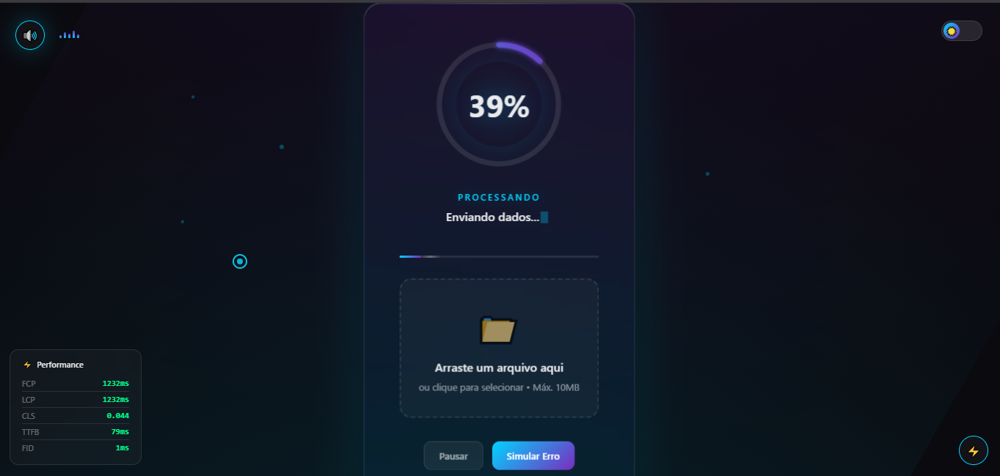
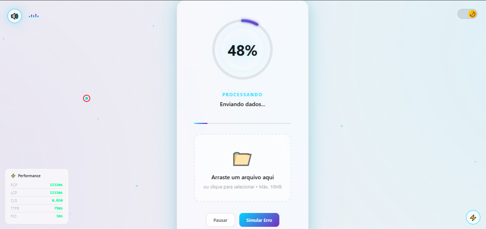

# Quantum Glass Loader 🚀

> Um loader moderno e interativo com **glassmorphism**, progressão **não-linear** e micro-interações fluidas. Desenvolvido como projeto de 7 dias para aprender boas práticas de frontend modular.

[]()
[](https://gustavodeoliveiradev.github.io/quantum-glass-loader/)
[](LICENSE)

<p align="center">
  
  
  
  
  
  
  
</p>

---

## 🎨 Preview

| Tema Escuro | Tema Claro |
|:-----------:|:----------:|
|  |  |

> 🌓 **Toggle de tema** no canto superior direito ou pressione `T`  
> 🔊 **Ative o som** clicando no 🔇 no canto superior esquerdo  
> ⚡ **Métricas de performance** clicando no ⚡ no canto inferior direito

---

## ✨ Features

- **🎨 Glassmorphism 2.0** — Efeito de vidro fosco com `backdrop-filter` e gradientes dinâmicos
- **🌓 Tema Dark/Light** — Toggle animado com persistência em `localStorage` e detecção do sistema
- **📊 Progresso Realista** — Simulação de rede com velocidades variáveis (não é linear!)
- **📤 Upload Real** — Arraste arquivos ou selecione para upload com progresso em bytes
- **🎵 Áudio Imersivo** — Web Audio API com pitch progressivo, arpeggio de sucesso, e visualizador
- **⚡ Web Vitals** — Monitoramento em tempo real de FCP, LCP, CLS, TTFB, FID
- **📱 PWA Completo** — Instalável, funciona offline, com prompt de instalação customizado
- **🛡️ Segurança** — Disclaimer de privacidade, validação de arquivos, sanitização de dados
- **🎯 Micro-interações** — Pausar, simular erro, reiniciar com animações suaves
- **🎉 Partículas** — Explosão de confete ao completar com física realista
- **⌨️ Acessibilidade** — Navegação por teclado, ARIA labels, `prefers-reduced-motion`, skip links
- **📱 Responsivo** — Adaptativo para mobile e desktop, sem highlight azul no toque

---

## 🎮 Controles

| Ação | Mouse | Teclado |
|------|-------|---------|
| Pausar/Continuar | Botão "Pausar" | `ESC` |
| Simular Erro | Botão "Simular Erro" | — |
| Reiniciar | Botão "Reiniciar" | `R` |
| Alternar Tema | Toggle no canto superior direito | `T` |
| Alternar Som | Botão 🔇/🔊 no canto superior esquerdo | `M` |
| Ver Performance | Botão ⚡ no canto inferior direito | — |
| Selecionar Arquivo | Click na área de upload | — |
| Cancelar Upload | Botão "Reiniciar" durante upload | `R` |

---

## ⚡ Web Vitals — O que significa cada métrica?

| Sigla | Nome | O que mede | Ideal |
|-------|------|-----------|-------|
| **FCP** | First Contentful Paint | Quando o primeiro conteúdo aparece | < 1.8s 🟢 |
| **LCP** | Largest Contentful Paint | Quando o maior elemento carrega | < 2.5s 🟢 |
| **CLS** | Cumulative Layout Shift | Quanto a tela "pula" durante loading | < 0.1 🟢 |
| **TTFB** | Time to First Byte | Tempo até o servidor responder | < 800ms 🟢 |
| **FID** | First Input Delay | Delay até responder ao primeiro clique | < 100ms 🟢 |

> Clique no ⚡ no canto inferior direito para ver as métricas em tempo real!

---

## 🏗️ Arquitetura Modular

```
quantum-loader/
├── index.html              # Estrutura semântica + SEO meta tags
├── manifest.json           # PWA manifest
├── LICENSE                 # MIT License
├── css/
│   ├── base.css            # Variáveis de tema, reset, utilitários, mobile fixes
│   ├── theme-toggle.css    # Switch dark/light animado
│   ├── audio-controls.css  # Toggle de som + visualizador
│   ├── glass-container.css # Efeito vidro + estados visuais
│   ├── progress-ring.css   # SVG circular com glow
│   ├── typography.css      # Textos + efeito digitação
│   ├── controls.css        # Botões + interações
│   ├── upload-zone.css     # Área de drag & drop
│   ├── file-list.css       # Lista de arquivos
│   ├── disclaimer.css      # Modal de segurança
│   ├── performance-panel.css # Painel de métricas Web Vitals
│   ├── pwa-install.css     # Banner de instalação PWA
│   └── offline-toast.css   # Notificação de status de rede
└── js/
    ├── config.js           # Constantes centralizadas
    ├── state.js            # Gerenciamento de estado
    ├── theme-manager.js    # Sistema de temas (localStorage + sistema)
    ├── disclaimer.js       # Modal de segurança
    ├── audio-engine.js     # Web Audio API (som imersivo)
    ├── animation-engine.js # Animações avançadas sincronizadas
    ├── particles.js        # Sistema de confete (Canvas API)
    ├── api-client.js       # Cliente HTTP com progresso real
    ├── ui-updater.js       # Atualizações DOM centralizadas
    ├── progress.js         # Lógica de animação não-linear
    ├── upload-manager.js   # Gerenciamento de upload
    ├── performance-monitor.js # Monitoramento Web Vitals
    ├── pwa-manager.js      # Gerenciamento PWA (install, offline, updates)
    ├── service-worker.js   # Cache de assets + offline support
    └── main.js             # Orquestrador
```

---

## 🚀 Como Usar

### Modo Upload Real
1. Arraste um arquivo para a área pontilhada ou clique para selecionar
2. Veja o progresso em **tempo real** com bytes enviados/total
3. Ao completar, confete explode e você ouve o som de sucesso!

### Modo Simulado
1. Clique em qualquer lugar fora da área de upload
2. O loader inicia automaticamente com progresso simulado
3. Use os botões para pausar, simular erro ou reiniciar

### Áudio
1. Clique no 🔇 no canto superior esquerdo para ativar o som
2. O pitch sobe conforme o progresso aumenta
3. Ao completar, ouça o arpeggio de sucesso (C-E-G-C)

### Performance
1. Clique no ⚡ no canto inferior direito
2. Veja métricas Web Vitals em tempo real (FCP, LCP, CLS, TTFB, FID)
3. Cores indicam: 🟢 bom / 🟡 melhorar / 🔴 ruim

### Instalar como App (PWA)
1. Clique no banner de instalação na parte inferior (quando aparecer)
2. Ou use o menu do navegador: "Instalar Quantum Glass Loader"
3. O app funciona **offline** e aparece na tela inicial!

### Local
```bash
git clone https://github.com/gustavodeoliveiradev/quantum-glass-loader.git
cd quantum-glass-loader
# Abrir index.html no navegador ou usar servidor local
npx serve .
```

### GitHub Pages
🔗 **Acesse:** [gustavodeoliveiradev.github.io/quantum-glass-loader/](https://gustavodeoliveiradev.github.io/quantum-glass-loader/)

---

## 📅 Cronograma de Desenvolvimento (7 Dias)

| Dia | Foco | Status | Commit |
|-----|------|--------|--------|
| **Dia 1** | Estrutura modular + Design System + Glassmorphism | ✅ Concluído | `feat: initial Quantum Glass Loader implementation` |
| **Dia 2** | Tema Dark/Light toggle + Persistência + Detecção SO | ✅ Concluído | `feat: add dark/light theme toggle system` |
| **Dia 3** | Upload Real com Drag & Drop + Segurança | ✅ Concluído | `feat: add real file upload with drag & drop and security disclaimer` |
| **Dia 4** | Web Audio API + Animações Avançadas | ✅ Concluído | `feat: add Web Audio API and advanced animations` |
| **Dia 5** | Performance + Web Vitals + Mobile Fixes | ✅ Concluído | `feat: add performance monitor with Web Vitals metrics` |
| **Dia 6** | PWA Completo + Offline + Install Prompt + License | ✅ Concluído | `feat: add PWA complete support with install prompt and offline mode` |
| **Dia 7** | Documentação final + Polish + Deploy | ✅ Concluído | `feat: Day 7 final polish - documentation and deploy` |

> ✅ **Projeto concluído com sucesso!** 7 dias, 15+ commits, 30+ arquivos, 1 aplicação sensacional.

---

## 🛠️ Tecnologias

- **HTML5** Semântico + ARIA
- **CSS3** — Grid, Flexbox, Custom Properties, Backdrop Filter, SVG Filters
- **JavaScript ES6+** — Módulos, Classes, RequestAnimationFrame, localStorage API
- **SVG** — Gradientes, Filters (`feGaussianBlur`), `stroke-dasharray` animation
- **Canvas API** — Sistema de partículas com física
- **XMLHttpRequest** — Upload com monitoramento de progresso real
- **Web Audio API** — Osciladores, envelopes, analisador de frequência
- **Performance API** — PerformanceObserver, Web Vitals
- **Service Worker** — Cache de assets, offline support, background sync
- **Web App Manifest** — PWA installable, splash screen, theme color

---

## 🛡️ Segurança

- ✅ **Disclaimer** explicativo mostrado antes do primeiro upload
- ✅ **Validação** de tipo e tamanho de arquivo (máx. 10MB)
- ✅ **Sanitização** de nomes de arquivo (prevenção XSS)
- ✅ **API de teste** (httpbin.org) — não armazena dados permanentemente
- ✅ **Sem coleta** de dados pessoais, localização ou informações sensíveis
- ✅ **Áudio opt-in** — só ativa após interação do usuário (política de autoplay)

---

## 🎯 Objetivo de Aprendizado

Este projeto foi criado para praticar:
- ✅ Separação de responsabilidades (SOC)
- ✅ Arquitetura modular frontend
- ✅ Animações performáticas (GPU accelerated)
- ✅ Acessibilidade web (a11y)
- ✅ Git workflow com commits semânticos
- ✅ Design system com variáveis CSS
- ✅ Persistência de preferências do usuário
- ✅ Upload de arquivos com progresso real
- ✅ Validação e sanitização de dados
- ✅ Web Audio API para feedback sonoro
- ✅ Sincronização áudio-visual em tempo real
- ✅ Monitoramento de performance (Web Vitals)
- ✅ Progressive Web App (PWA) completo
- ✅ Service Worker com cache e offline

---

## 🤝 Agradecimentos

Agradeço ao **App Launcher** pela motivação:

> *"Glassmorphism loaders are underrated. Day 1 energy is elite."*

---

## 📄 Licença

Este projeto está licenciado sob a [MIT License](LICENSE) — sinta-se livre para usar e modificar!

---

<p align="center">
  Feito com 💙 e muito café durante 7 dias de coding<br>
  <a href="https://gustavodeoliveiradev.github.io/quantum-glass-loader/">🚀 Ver ao vivo</a>
</p>
